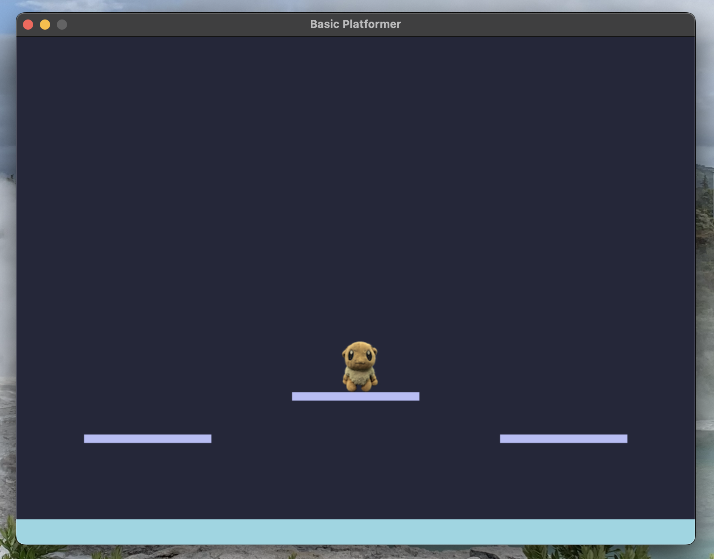

# platformer
hii this just a simple platformer in pygame

Made as a hobby so don't expect it to be polished at all

## CONTROLS
Arrow keys except up to move

Space to jump

## INSTALLATION
make sure to have pygame installed on your machine

Use

pip install pygame -or-

pip3 install pygame

in terminal

## Booting the Game
ONLY, I repeat, ONLY IDLE can be used to launch game, any other software will cause issues
(not Xcode)

Just click run after launching platformer.py
